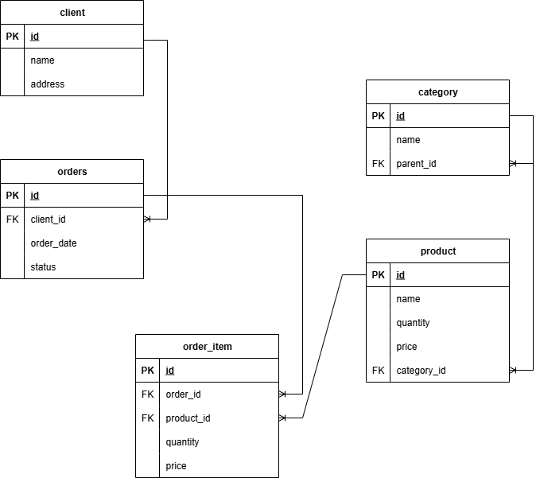

# Order Service (DRF + PostgreSQL)

Этот проект реализует схему БД, SQL‑запросы и REST‑сервис для работы с заказами и номенклатурой.

---

##  Функционал

* Реляционная БД (PostgreSQL):

  * Категории товаров с неограниченной вложенностью (Adjacency List);
  * Товары (номенклатура) с количеством и ценой;
  * Клиенты;
  * Заказы и состав заказов.
* SQL‑запросы:

  * 2.1. Сумма товаров по каждому клиенту;
  * 2.2. Подсчёт дочерних категорий первого уровня;
  * 2.3. Отчёт «Топ‑5 товаров за последний месяц» (view).
* REST‑сервис (DRF):

  * Метод `POST /orders/{order_id}/items` для добавления товара в заказ.
  * Проверка остатков на складе.
  * Если товар уже есть в заказе — количество увеличивается.
* Контейнеризация (Docker + docker‑compose).

---

## Установка и запуск

### 1. Клонировать проект

```bash
git clone <url> test_task
cd test_task
```

### 2. Запуск через Docker Compose

```bash
docker compose up --build
```

Поднимутся два контейнера:

* **db** — PostgreSQL 16
* **api** — DRF‑сервис


## Основные эндпоинты
### Просмотр продуктов
`GET /api/products/`

### Просмотр заказов
`GET /api/orders/`

### Добавление товара в заказ

`POST api/orders/{order_id}/items`

#### Параметры

* `order_id` — ID заказа (в URL)

#### Тело запроса (JSON)

```json
{
  "product_id": 123,
  "quantity": 2
}
```

#### Успешный ответ (200 OK)

```json
{
  "order_id": 1,
  "product_id": 123,
  "quantity": 5,
  "price": 19990.00
}
```

#### Ошибки

* `404` — заказ или товар не найден;
* `409` — недостаточно товара на складе.

---

##  Схема данных (DDL)

* Таблицы: `category`, `product`, `client`, `orders`, `order_item`.
* `order_item` хранит цену товара на момент покупки.
* В `category` используется поле `parent_id` для дерева категорий.
* Ограничения (`CONSTRAINT`) и индексы обеспечивают целостность и скорость работы.

---

##  SQL‑запросы (п.2)
### Следующие SQL-запросы можно проверить с помощью команды:
```docker compose exec db psql -U postgres -d shop```

### 2.1. Сумма товаров по каждому клиенту

```sql
SELECT c.name AS client_name,
       COALESCE(SUM(oi.quantity * oi.price), 0) AS total_amount
FROM mainapp_client c
LEFT JOIN mainapp_order o ON o.client_id = c.id
LEFT JOIN mainapp_orderitem oi ON oi.order_id = o.id
GROUP BY c.id, c.name
ORDER BY total_amount DESC;
```

### 2.2. Количество дочерних категорий первого уровня

```sql
SELECT p.id AS category_id,
       p.name AS category_name,
       COUNT(c.id) AS child_count
FROM mainapp_category p
LEFT JOIN mainapp_category c ON c.parent_id = p.id
GROUP BY p.id, p.name
ORDER BY category_id;
```

### 2.3. View «Топ‑5 самых покупаемых товаров за последний месяц»

```sql
CREATE OR REPLACE VIEW top5_products_last_month AS
WITH period AS (
    SELECT (CURRENT_DATE - INTERVAL '1 month') AS dt_from,
           CURRENT_DATE AS dt_to
)
SELECT p.name AS product_name,
       c.name AS category_name,
       SUM(oi.quantity) AS total_qty
FROM mainapp_order o
JOIN period t ON o.order_date >= t.dt_from AND o.order_date < t.dt_to
JOIN mainapp_orderitem oi ON oi.order_id = o.id
JOIN mainapp_product p ON p.id = oi.product_id
JOIN mainapp_category c ON c.id = p.category_id
GROUP BY p.name, c.name
ORDER BY total_qty DESC
LIMIT 5;

```

---

##  Оптимизация (2.3.2)

* Индексы по `order_date`, `order_id`, `product_id`.
* Денормализация: хранить `root_category_id` в `product`.
* Материализованные view для агрегаций.
* Партиционирование таблиц `orders` и `order_item` по дате.
* Closure Table или Materialized Path для оптимизации запросов по дереву категорий.

---

##  Технологии

* **Backend**: Python 3.12, Django, DRF
* **Database**: PostgreSQL 16
* **Infra**: Docker, docker‑compose

---

## TODO / Возможные улучшения

* Unit‑тесты (pytest + httpx).
* CI/CD (GitHub Actions).
* Redis‑кэш для отчётных запросов.
